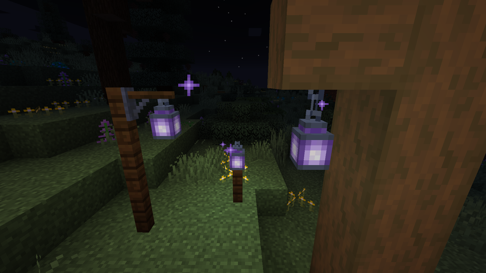
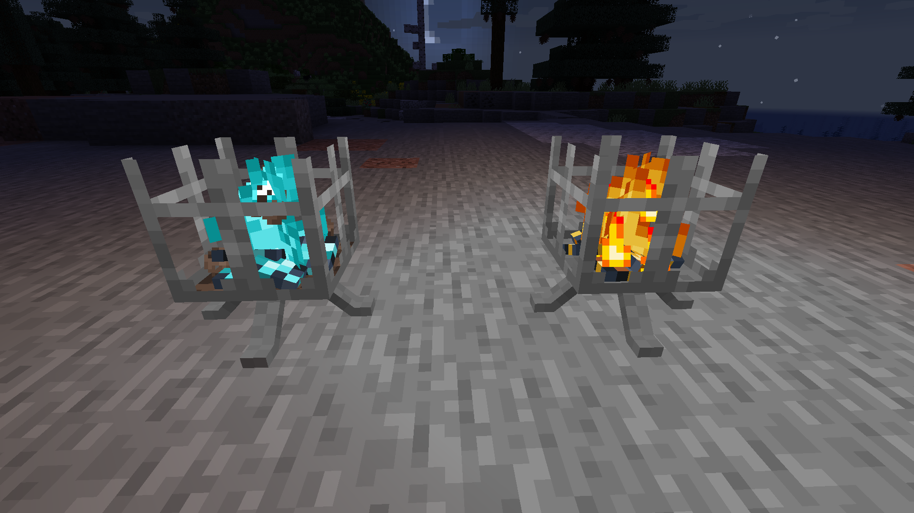

# Aurora's Decorations
<!-- modrinth_exclude.start -->
 <!-- modrinth_exclude.end -->

[![Mod loader: Fabric]][fabric] <!-- modrinth_exclude.start -->
 <!-- modrinth_exclude.end -->

Decorations-focused Fabric mod.

## What's this mod?

Aurora's Decorations adds new decorations features like wall lantern or big flower pot.

### Features:

- Amethyst Lantern
  - Cancels natural mob spawning in a 32 blocks radius around it.
  - Mobs are afraid of it.
  - Helps curing zombie villagers.
  - Can be crafted with 2 amethyst shards and one lantern.
- Armor stand
  - Right-click with sticks to add arms.
  - Shift-Right-click with shears to hide the base plate.
- Benches
  - Come in all wood types!
  - You can sit on them!
  - Customize them with a seat rest.
- Big Flower Pot Block
  - Can hold a plant, can dynamically support some modded plants (or new plants in Minecraft if the mod hasn't been updated).
  - Can hold tall plants.
- Blackboards
  - Come in two variants: blackboard and chalkboard (dark green).
  - Players can edit them if not waxed.
    - Dyes to write.
    - Paper to clear a pixel.
    - Water bottle to clear the whole blackboard and consume its water.
    - Water bucket to clear the whole blackboard.
    - Glow ink sack to make it glow.
    - Ink sack to make it not glow.
  - Can be waxed to be protected from edit and from water. Use honeycomb in a smithing table to wax them.
  - Water-sensitive, if not waxed they will lose their content.
  - Content can be cloned by combining an empty blackboard and a written blackboard in a crafting table.
  - Can be worn as a mask.
- Braziers
  - A new nice light source crafted with iron ingots and a campfire.
  - Burns entities that stands inside them.
  - Comes in normal and soul variants.
- Burnt-vine
  - Use a flint of steel on a vine block to burn the tip of a vine.
  - Burnt-vine is not able to grow.
- Candles
  - Can now be put on walls.
  - Can now be put on ceilings as chandeliers.
- Copper Sulfate
  - Made by exploding copper blocks.
  - Copper Sulfate Torch with a green tint.
  - Copper Sulfate Lantern.
  - Copper Sulfate Campfire and Brazier.
    - Decay leaves, mushroom blocks and nether wart blocks.
    - Mushroom blocks and nether wart blocks are decayed like if Silk Touch was used.
- Item Frames can be made invisible when using shears on them while they hold an item.
  After the item is removed, the item frame will be visible again.
- Lanterns
  - Can now be placed on top of leaves.
  - Wall Lantern
    - Lanterns can now be placed on walls!
    - Can be waterlogged.
    - Swings!
    - Has special entity collision handling for swinging.
    - Supports modded lanterns.
- Nether brick fence gate
- Pet beds
  - Cozy little beds for your little friends!
  - Comes in all dye colors.
- Placeable books and enchanted books  
  You can now place piles of books in your world!
- Placeable Pumpkin Pie  
  Ever wished to share a pumpkin pie with your friends?
  Or just place it on a table to eat it later?
  Now you can!
- Polished Basalt Wall
- Sawmill
  - Craft many wooden blocks with a similar mechanic as the stonecutter.
  - Reduce the cost in wood of certain blocks like trapdoors.
- Shelves
  - Comes in every wood types.
    - Supports some modded wood types.
  - Can be put on the bottom or/and the top of the side of a block.
  - Stores up to 8 stacks that are displayed in-world.
  - Right-click with an item will place it into the shelf.
  - Left-click with an empty world in survival will emptied the targeted item.
  - Waterloggable.
- Sign Posts
  - Place it on a fence post!
  - Use it to indicate directions.
  - Right-click empty-handed to edit the text.
  - Right-click empty-handed while sneaking to invert the direction.
  - Right-click with a compass to point to the world spawn.
  - Right-click with a lodestone compass to point to a lodestone.
  - Right-click with glow ink to make the text glow.
  - Right-click with dye to make the text colored.
- Sleeping bags
  - Cozy to sleep while on your outside adventures.
  - Players and villagers can sleep in them.
  - Craft with 3 wools.
  - Do not set spawn point.
- Small Log Piles
  - Looks similar to campfire logs, but the ash part is replaced with more logs.
  - Come in all wood types.
  - Can be stacked.
- Stumps
  - Cozy seat.
  - Made using logs in a sawmill.
- Sturdy Stone
  - Cannot be moved by pistons or slime/honey blocks.
  - Can transmit state change in an observer chain.
    Perfect as a dispenser or dropper replacement in some contraptions!
- Tie leads to fences  
  Leads can now be tied directly between two fences, rather than only fence-mob.

## Pictures

[fabric]: https://fabricmc.net
[Mod loader: Fabric]: https://img.shields.io/badge/modloader-Fabric-1976d2?style=flat-square&logo=data:image/png;base64,iVBORw0KGgoAAAANSUhEUgAAACAAAAAgCAYAAABzenr0AAAACXBIWXMAAAsTAAALEwEAmpwYAAAFHGlUWHRYTUw6Y29tLmFkb2JlLnhtcAAAAAAAPD94cGFja2V0IGJlZ2luPSLvu78iIGlkPSJXNU0wTXBDZWhpSHpyZVN6TlRjemtjOWQiPz4gPHg6eG1wbWV0YSB4bWxuczp4PSJhZG9iZTpuczptZXRhLyIgeDp4bXB0az0iQWRvYmUgWE1QIENvcmUgNS42LWMxNDIgNzkuMTYwOTI0LCAyMDE3LzA3LzEzLTAxOjA2OjM5ICAgICAgICAiPiA8cmRmOlJERiB4bWxuczpyZGY9Imh0dHA6Ly93d3cudzMub3JnLzE5OTkvMDIvMjItcmRmLXN5bnRheC1ucyMiPiA8cmRmOkRlc2NyaXB0aW9uIHJkZjphYm91dD0iIiB4bWxuczp4bXA9Imh0dHA6Ly9ucy5hZG9iZS5jb20veGFwLzEuMC8iIHhtbG5zOmRjPSJodHRwOi8vcHVybC5vcmcvZGMvZWxlbWVudHMvMS4xLyIgeG1sbnM6cGhvdG9zaG9wPSJodHRwOi8vbnMuYWRvYmUuY29tL3Bob3Rvc2hvcC8xLjAvIiB4bWxuczp4bXBNTT0iaHR0cDovL25zLmFkb2JlLmNvbS94YXAvMS4wL21tLyIgeG1sbnM6c3RFdnQ9Imh0dHA6Ly9ucy5hZG9iZS5jb20veGFwLzEuMC9zVHlwZS9SZXNvdXJjZUV2ZW50IyIgeG1wOkNyZWF0b3JUb29sPSJBZG9iZSBQaG90b3Nob3AgQ0MgMjAxOCAoV2luZG93cykiIHhtcDpDcmVhdGVEYXRlPSIyMDE4LTEyLTE2VDE2OjU0OjE3LTA4OjAwIiB4bXA6TW9kaWZ5RGF0ZT0iMjAxOS0wNy0yOFQyMToxNzo0OC0wNzowMCIgeG1wOk1ldGFkYXRhRGF0ZT0iMjAxOS0wNy0yOFQyMToxNzo0OC0wNzowMCIgZGM6Zm9ybWF0PSJpbWFnZS9wbmciIHBob3Rvc2hvcDpDb2xvck1vZGU9IjMiIHBob3Rvc2hvcDpJQ0NQcm9maWxlPSJzUkdCIElFQzYxOTY2LTIuMSIgeG1wTU06SW5zdGFuY2VJRD0ieG1wLmlpZDowZWRiMWMyYy1mZjhjLWU0NDEtOTMxZi00OTVkNGYxNGM3NjAiIHhtcE1NOkRvY3VtZW50SUQ9InhtcC5kaWQ6MGVkYjFjMmMtZmY4Yy1lNDQxLTkzMWYtNDk1ZDRmMTRjNzYwIiB4bXBNTTpPcmlnaW5hbERvY3VtZW50SUQ9InhtcC5kaWQ6MGVkYjFjMmMtZmY4Yy1lNDQxLTkzMWYtNDk1ZDRmMTRjNzYwIj4gPHhtcE1NOkhpc3Rvcnk+IDxyZGY6U2VxPiA8cmRmOmxpIHN0RXZ0OmFjdGlvbj0iY3JlYXRlZCIgc3RFdnQ6aW5zdGFuY2VJRD0ieG1wLmlpZDowZWRiMWMyYy1mZjhjLWU0NDEtOTMxZi00OTVkNGYxNGM3NjAiIHN0RXZ0OndoZW49IjIwMTgtMTItMTZUMTY6NTQ6MTctMDg6MDAiIHN0RXZ0OnNvZnR3YXJlQWdlbnQ9IkFkb2JlIFBob3Rvc2hvcCBDQyAyMDE4IChXaW5kb3dzKSIvPiA8L3JkZjpTZXE+IDwveG1wTU06SGlzdG9yeT4gPC9yZGY6RGVzY3JpcHRpb24+IDwvcmRmOlJERj4gPC94OnhtcG1ldGE+IDw/eHBhY2tldCBlbmQ9InIiPz4/HiGMAAAAtUlEQVRYw+XXrQqAMBQF4D2P2eBL+QIG8RnEJFaNBjEum+0+zMQLtwwv+wV3ZzhhMDgfJ0wUSinxZUQWgKos1JP/AbD4OneIDyQPwCFniA+EJ4CaXm4TxAXCC0BNHgLhAdAnx9hC8PwGSRtAFVMQjF7cNTWED8B1cgwW20yfJgAvrssAsZ1cB3g/xckAxr6FmCDU5N6f488BrpCQ4rQBJkiMYh4ACmLzwOQF0CExinkCsvw7vgGikl+OotaKRwAAAABJRU5ErkJggg==