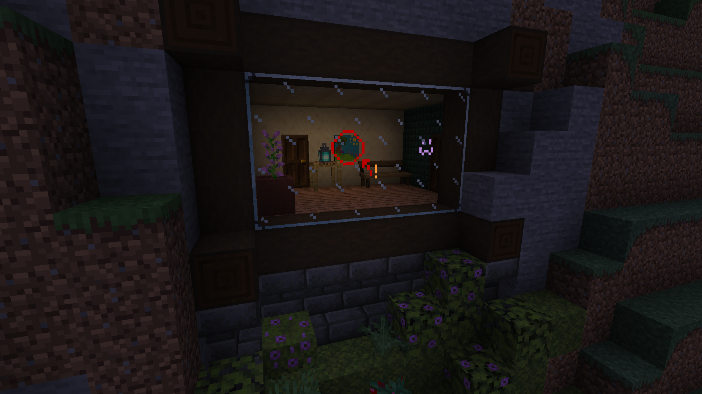

# Blackboards

<!--description:Learn everything about the blackboards!
Wonderful blocks on which you can draw on.-->
<!--thumbnail:images/blackboards.png;A picture of blackboards and chalkboards with stuff drawn on it.;large-->

Blackboards are blocks which you can draw on with dyes. 
They come in three variants: blackboard, chalkboard (green), and glassboard (transparent).

They can be placed, or worn as masks on the helmet slot, and on a dedicated slot if [Trinkets] is present.

To be placed, they will need a support block like candles, and they won't break if the support block is removed afterwards.

*Blackboards and Chalkboards*

*Glassboards!*

## Crafting

### Blackboard

<table class="crafting-grid">
<thead>
    <th>Crafting Table</th>
</thead>
<tbody>
    <tr>
        <td>Stick</td>
        <td>Stick</td>
        <td>Stick</td>
    </tr>
    <tr>
        <td>Stick</td>
        <td>Black Concrete</td>
        <td>Stick</td>
    </tr>
    <tr>
        <td>Stick</td>
        <td>Stick</td>
        <td>Stick</td>
    </tr>
</tbody>
</table>

### Chalkboard

<table class="crafting-grid">
<thead>
    <th>Crafting Table</th>
</thead>
<tbody>
    <tr>
        <td>Stick</td>
        <td>Stick</td>
        <td>Stick</td>
    </tr>
    <tr>
        <td>Stick</td>
        <td>Green Concrete</td>
        <td>Stick</td>
    </tr>
    <tr>
        <td>Stick</td>
        <td>Stick</td>
        <td>Stick</td>
    </tr>
</tbody>
</table>

### Glassboard

<table class="crafting-grid">
<thead>
    <th>Crafting Table</th>
</thead>
<tbody>
    <tr>
        <td>Stick</td>
        <td>Stick</td>
        <td>Stick</td>
    </tr>
    <tr>
        <td>Stick</td>
        <td>Glass Pane</td>
        <td>Stick</td>
    </tr>
    <tr>
        <td>Stick</td>
        <td>Stick</td>
        <td>Stick</td>
    </tr>
</tbody>
</table>

### Copy

You can copy a blackboard's content onto another blackboard by combining a drawn blackboard and an empty blackboard in a crafting grid.

## Drawing

To draw on a blackboard use a [dye][dyes] or a [Painter's Palette](painter_palette.md) on blackboard in-game,
it will color the targeted pixel.
You can shade a pixel using bone meal to lighten it, or coal to darken it;
and you can use glowstone dust to toggle the saturation state of a pixel.

To draw multiple things at once, you can hold in your off-hand:
 - a white wool to use a "brush".
 - a bucket to fill an area.
 - an ender-pearl to replace a color.
 - a stick to draw lines.

To erase a blackboard you can either:
 - put it in water
 - use a water bucket on it
 - use a water potion on it, will consume the water in the bottle
 - place a non-waxed blackboard in water

You also can erase a single pixel with paper.

A blackboard can glow in the dark if a glow ink sac is used on it, to stop the glow a normal ink sac can be used.

Once you are satisfied with your drawing you can use wax it using honeycomb, either by right-clicking it or by using a smithing table.
Waxed blackboards are made uneditable.

### Dyes

- `#f9fffe` White Dye
- `#f9801d` Orange Dye
- `#c74ebd` Magenta Dye
- `#3ab3da` Light Blue Dye
- `#fed83d` Yellow Dye
- `#80c71f` Lime Dye
- `#f38baa` Pink Dye
- `#474f52` Gray Dye
- `#9d9d97` Light Gray Dye
- `#169c9c` Cyan Dye
- `#8932b8` Purple Dye
- `#3c44aa` Blue Dye
- `#835432` Brown Dye
- `#5e7c16` Green Dye
- `#b02e26` Red Dye
- `#1d1d21` Black Dye
- `#bb0000` Sweet Berries
- `#ff9737` Glow Berries
- [`#b886db` Lavender](plants/lavender.md)
- `#006ac6` Blueberries (if Ecotones is present)

[dyes]: #dyes
[Trinkets]: https://modrinth.com/mod/trinkets
