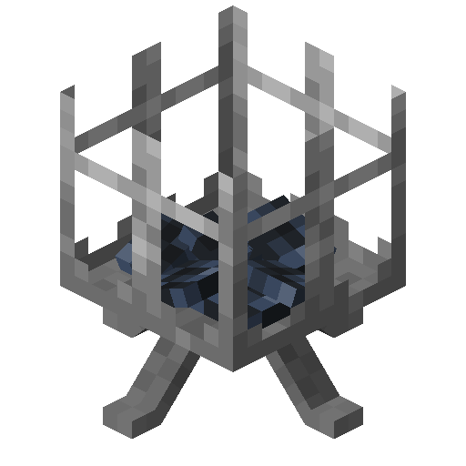
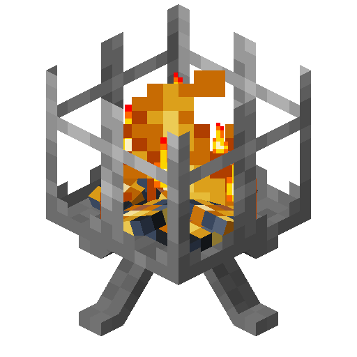
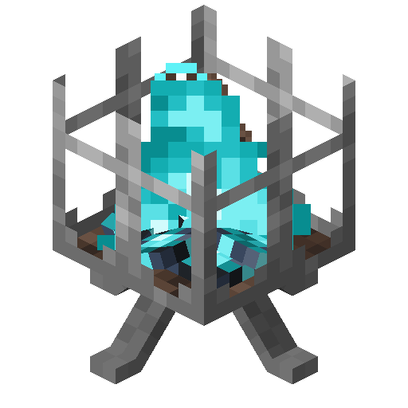

# Braziers

<!--description:Learn everything about braziers, a new decorative light source.-->
<!--thumbnail:images/render/lit_brazier.png-->

Braziers are decorative light sources that come in three different types: regular, soul and [copper sulfate](copper_sulfate.md).  
They can be extinguished with a shovel, and lit up with a flint and steel, like campfires.

## Crafting

<table class="crafting-grid">
<thead>
    <th>Crafting Table</th>
</thead>
<tbody>
    <tr>
        <td>Iron Ingot</td>
        <td>Campfire</td>
        <td>Iron Ingot</td>
    </tr>
    <tr>
        <td></td>
        <td>Iron Ingot</td>
        <td></td>
    </tr>
</tbody>
</table>

Note: the type of the resulting brazier will depend on the type of campfire put into the recipe.

## Notes

- Braziers will burn entities inside them.
- Copper Sulfate Brazier inherits the special properties of the [Copper Sulfate Campfire](copper_sulfate.md#campfire)
