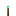
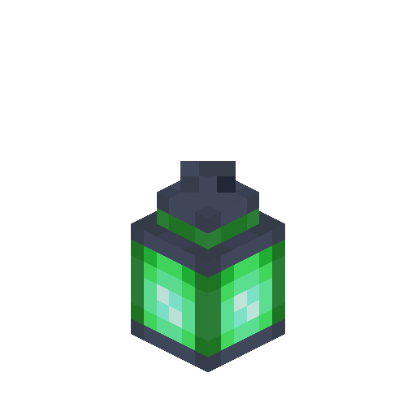
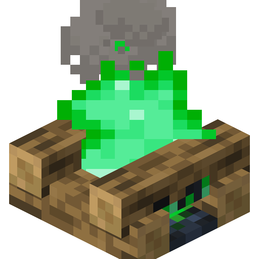
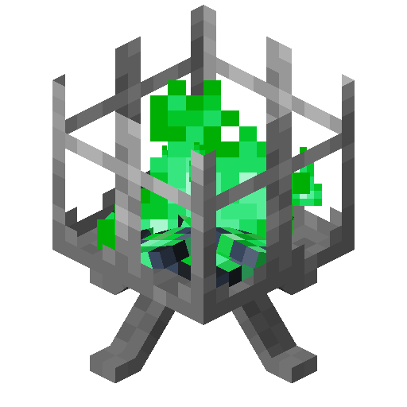

# Copper Sulfate

<!--description:Learn everything about copper sulfate, a new item to craft multiple things.-->
<!--thumbnail:images/assets/item/copper_sulfate.png-->

Copper Sulfate ([Copper(II) Sulfate][copper_sulfate_wikipedia])
is an item created from copper. It has a wide usage in crafting new light sources with green flames.

## Crafting

Copper sulfate is crafted from exploding copper blocks, here's a table on the quantity yield depending on the oxidization state of the copper block:

<table class="ls_grid_table explosion-crafting">
<thead>
    <th>Oxidization State</th>
    <th>Quantity Yield</th>
</thead>
<tbody>
    <tr>
        <td>Copper Block</td>
        <td>9 x </td>
    </tr>
    <tr>
        <td>Exposed Copper Block</td>
        <td>14 x </td>
    </tr>
    <tr>
        <td>Weathered Copper Block</td>
        <td>18 x </td>
    </tr>
    <tr>
        <td>Oxidized Copper Block</td>
        <td>32 x </td>
    </tr>
</tbody>
</table>

## Usage

The item itself doesn't really have any uses, but it can be used in crafting to create some new blocks!

### Copper Sulfate Torch

The copper sulfate torch is similar to a torch, except it has a green flame instead.

#### Crafting

<table class="crafting-grid" style="width: max-content;">
<thead>
    <th>Crafting Table</th>
</thead>
<tbody>
    <tr>
        <td>Coal (or Charcoal)</td>
    </tr>
    <tr>
        <td>Stick</td>
    </tr>
    <tr>
        <td>
            
        </td>
    </tr>
</tbody>
</table>

### Copper Sulfate Lantern

The copper sulfate lantern is similar to a lantern, except it has a green flame instead.

#### Crafting

<table class="crafting-grid" style="width: max-content;">
<thead>
    <th>Crafting Table</th>
</thead>
<tbody>
    <tr>
        <td>Iron Nugget</td>
        <td>Iron Nugget</td>
        <td>Iron Nugget</td>
    </tr>
    <tr>
        <td>Iron Nugget</td>
        <td>
            
        </td>
        <td>Iron Nugget</td>
    </tr>
    <tr>
        <td>Iron Nugget</td>
        <td>Iron Nugget</td>
        <td>Iron Nugget</td>
    </tr>
</tbody>
</table>

### Copper Sulfate Campfire

This is the copper sulfate variant of campfires, you still can cook with them, but I wouldn't recommend it due to the toxicity of copper sulfate.

The copper sulfate campfire decays leaves, mushroom blocks, and nether wart blocks on top of it. Mushroom blocks and nether wart blocks are decayed like if Silk Touch was used.

#### Crafting

<table class="crafting-grid">
<thead>
    <th>Crafting Table</th>
</thead>
<tbody>
    <tr>
        <td></td>
        <td>Stick</td>
        <td></td>
    </tr>
    <tr>
        <td>Stick</td>
        <td></td>
        <td>Stick</td>
    </tr>
    <tr>
        <td>Log</td>
        <td>Log</td>
        <td>Log</td>
    </tr>
</tbody>
</table>

### Copper Sulfate Brazier

This is the copper sulfate variant of the [brazier](braziers.md), it inherits the special properties of the [copper sulfate campfire][copper_sulfate_campfire].

#### Crafting

<table class="crafting-grid">
<thead>
    <th>Crafting Table</th>
</thead>
<tbody>
    <tr>
        <td>Iron Ingot</td>
        <td></td>
        <td>Iron Ingot</td>
    </tr>
    <tr>
        <td></td>
        <td>Iron Ingot</td>
        <td></td>
    </tr>
</tbody>
</table>

[copper_sulfate_campfire]: #copper-sulfate-campfire
[copper_sulfate_wikipedia]: https://en.wikipedia.org/wiki/Copper%28II%29_sulfate "Wikipedia page"
