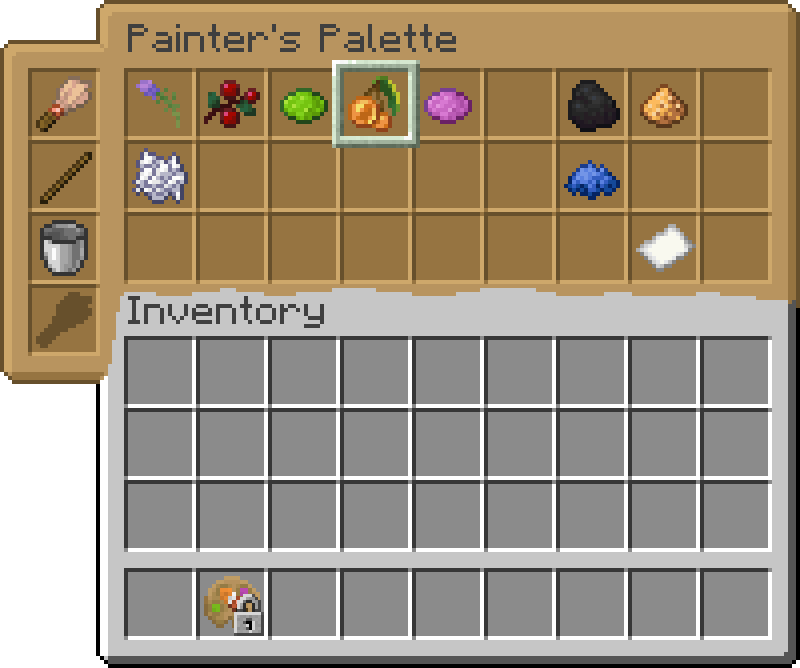

# Painter's Palette

<!--description:Learn everything about the Painter's Palette!
A very helpful item when drawing on blackboards.-->
<!--thumbnail:images/render/item/painter_palette.png-->

Painter's Palette is a tool item designed to be used along with <a href="blackboards.md">blackboards</a>.  
This item have an inventory capable of holding different blackboard-based <a href="blackboards.md#dyes">dyes</a>, some modifiers, and drawing tools.

*A Painter's Palette without any <a href="blackboards.md#dyes">dyes</a>.*

*A Painter's Palette with various <a href="blackboards.md#dyes">dyes</a>, the one in the middle represent the selected one.*

## Crafting

<table class="crafting-grid">
<thead>
    <th>Crafting Table</th>
</thead>
<tbody>
    <tr>
        <td>Wool</td>
        <td>Stick</td>
        <td>Planks</td>
    </tr>
</tbody>
</table>

## Use

### Inventory

The Painter's Palette contains an inventory capable of holding 4 drawing tools, and 27 [dye (including modifiers and paper)][dyes] items.
The inventory can only hold one item per slot.

To access it, either shift right-click while holding the item, or right-click the item while in an inventory.

While in the inventory, the slot where the Painter's Palette reside will be locked.
Some items may be highlighted with a special border, indicating they are currently selected for drawing.  
Selected items can be changed by middle-clicking on another item (or outside the GUI to select the pixel tool).

### In-World

Right-clicking on a [blackboard][blackboards] will draw on it as-if the selected items were in the player's hands.

When the item is selected in the hotbar, if you scroll while holding shift the selected color will be changed,
the tool too if the control key is held.

[blackboards]: ./blackboards.md
[dyes]: ./blackboards.md#dyes
