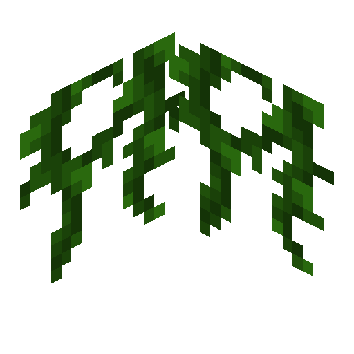

# Burnt Vine

<!--description:Learn everything about the burnt vine block, a variant of the vine block.-->
<!--thumbnail:images/burnt_vine;Picture of burnt vine, similar to vines but they more clearly stop at the bottom.-->

Vines are a really nice decorative organic block, they can make your builds look abandoned,
or very organic, they give more life to some trees, etc.

Though, they always grow, and they continue, continue, continue, and never stop.
That's not good right?
What do you mean the solution is to use string?
No, let's burn it instead!

And here it is, the burnt vine.

## Usage

Burnt vine is only a block, it doesn't have an associated item form, to obtain it you will need to use flint and steel on a normal vine!

