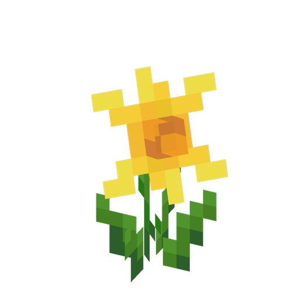
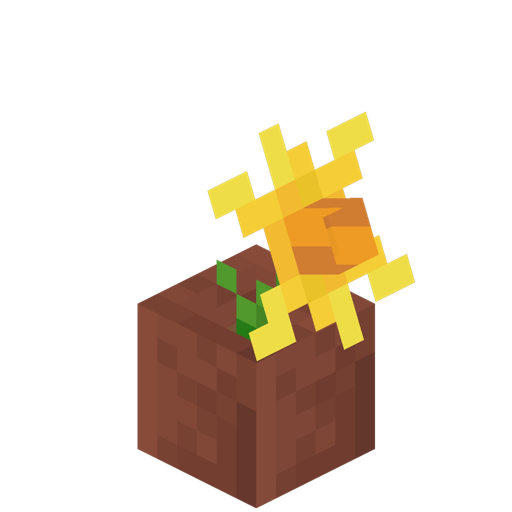

# Daffodil

<!--description:Learn everything about the daffodil, a nice yellow flower.-->
<!--thumbnail:images/assets/item/daffodil.png-->

Daffodil ([Narcissus pseudonarcissus][daffodil_wikipedia]) is an European flower with pale yellow tepals, with a darker central trumpet.
Daffodils can be placed with a specific orientation.

## Usage

Daffodils can be crafted into yellow dye.

## Locations

Daffodils can be found in flower forests and meadows.

[daffodil_wikipedia]: https://en.wikipedia.org/wiki/Narcissus_pseudonarcissus "Wikipedia page"
