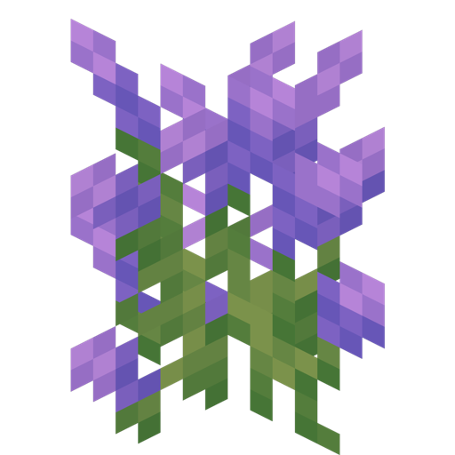
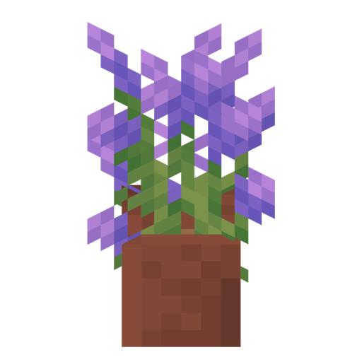

# Lavender

<!--description:Learn everything about the lavender, a very cozy flower.-->
<!--thumbnail:images/assets/item/lavender.png-->

[Lavender][lavender_wikipedia] is a common flower in temperate climates,
it has a nice shade of purple which lead the color to be named the same.

## Usage

Lavender can be crafted into purple dye. Lavender can also be used as a dye on [blackboards](../blackboards.md).

## Locations

 - Flower Forests
 - [Lavender Plains](../biomes/lavender_plains.md)  
   

[lavender_wikipedia]: https://en.wikipedia.org/wiki/Lavandula "Wikipedia page"
