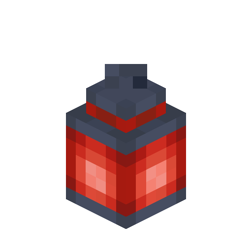
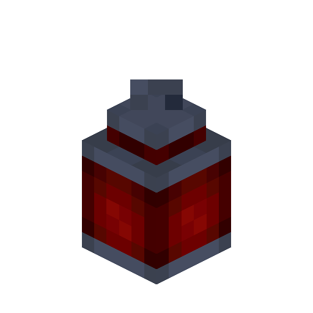
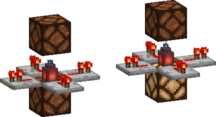
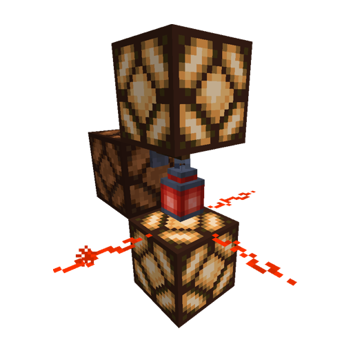
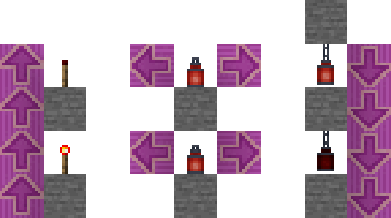

# Redstone Lantern

<!--description:Learn everything about the Redstone Lantern, a quite useful lantern for your redstone builds.-->
<!--thumbnail:images/render/redstone_lantern.png;Picture of a Redstone Lantern.-->

Redstone Lantern is a type of lantern which primary color is red, like redstone!  
They emit some redstone dust particles while placed and lit.

In addition to the cosmetic part of this lantern, the Redstone Lantern introduces new connection mechanics.
Aside from being like a Redstone Torch but waterloggable, they also prefer to transmit the power down rather than up.

## Crafting

<table class="crafting-grid">
<thead>
    <th>Crafting Table</th>
</thead>
<tbody>
    <tr>
        <td>Iron Nugget</td>
        <td>Iron Nugget</td>
        <td>Iron Nugget</td>
    </tr>
    <tr>
        <td>Iron Nugget</td>
        <td>Redstone Torch</td>
        <td>Iron Nugget</td>
    </tr>
    <tr>
        <td>Iron Nugget</td>
        <td>Iron Nugget</td>
        <td>Iron Nugget</td>
    </tr>
</tbody>
</table>

## Mechanics

A redstone lantern never affects the block it is attached to, even if it is a mechanism component.
For example, a redstone lantern attached to a redstone lamp does not activate the lamp.  
In addition to that, when placed on the floor it will never power up the elements above.

A redstone lantern will power up adjacent horizontal elements,
if hanging it will also power up downward, and upward if hung from the side of a block.

Redstone Lanterns experience "burn-out" like Redstone Torches, in doubt:
> A redstone torch experiences "burn-out" when it is forced to change state (by powering and de-powering the block it is attached to) more than eight times in 60 game ticks (three seconds, barring lag).
> 

> [Minecraft Wiki](https://minecraft.fandom.com/wiki/Redstone_Torch#Usage)
> 

### Pictures

#### Basic connectivity

#### Redstone Wall Lantern connectivity

#### Emission Directions

As you can see Redstone Lanterns allow to invert the behavior of Redstone Torches and transmit a signal along an axis downward.
