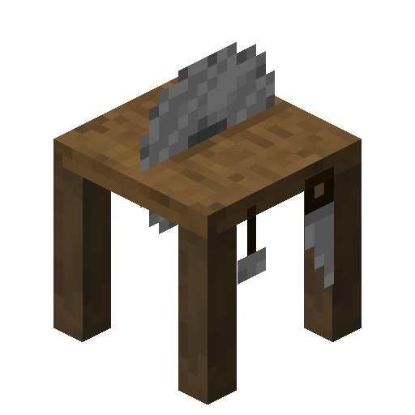

# Sawmill

<!--description:Learn everything about the Sawmill, a very practical crafting station.-->
<!--thumbnail:images/sawmill.png-->

The sawmill is a very practical crafting station centered around wood blocks.
It works the same as a regular stonecutter.

## Crafting

<table class="crafting-grid">
<thead>
    <th>Crafting Table</th>
</thead>
<tbody>
    <tr>
        <td></td>
        <td>Iron Ingot</td>
        <td></td>
    </tr>
    <tr>
        <td>Wooden Plank</td>
        <td>Wooden Plank</td>
        <td>Wooden Plank</td>
    </tr>
</tbody>
</table>

### Sawmill Available Recipes

From a log you can craft:
 - Log Stump
 - Planks (4)
 - Small Log Pile (2)
 - Wood

From a plank you can craft:
- Bench
- Boat
- Ladder (4)
- Seat Rest
- Shelf
- [Sign Post](sign_posts.md)
- Stick (2)
- Wooden Button
- Wooden Door
- Wooden Fence (2)
- Wooden Fence Gate
- Wooden Pressure Plate
- Wooden Slab (2)
- Wooden Stairs
- Wooden Trapdoor

## Notes

 - "Wooden" here means any of the available wood types in your game, it does not represent a single block in particular.
