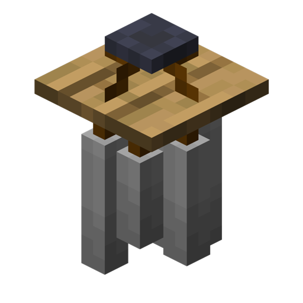

# Wind Chime

<!--description:Learn everything about the Wind Chime, an ambient suspended animated decorative block.-->
<!--thumbnail:images/render/wind_chime.png-->

Wind Chime is an ambient suspended decorative block.  
They are very animated. For example, when placed outside, they will sway with the wind. 
They can be right-clicked and they will sway harder, and will react to collisions! 
When animated, they will emit chime sounds.

<!-- TODO: include a video of the Wind Chime in action :3 -->

## Crafting

<table class="crafting-grid">
<thead>
    <th>Crafting Table</th>
</thead>
<tbody>
    <tr>
        <td></td>
        <td>String</td>
        <td></td>
    </tr>
    <tr>
        <td>Stick</td>
        <td>Stick</td>
        <td>Stick</td>
    </tr>
    <tr>
        <td>Iron Nugget</td>
        <td>Iron Nugget</td>
        <td>Iron Nugget</td>
    </tr>
</tbody>
</table>
