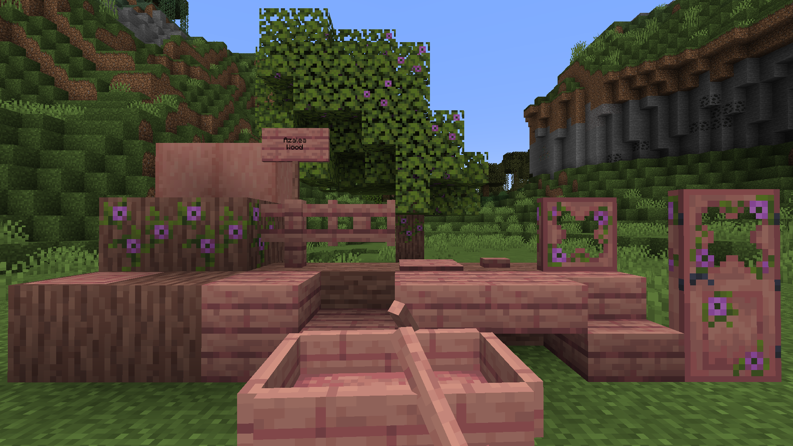
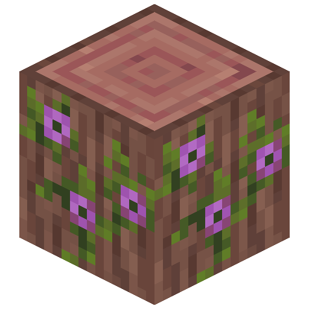
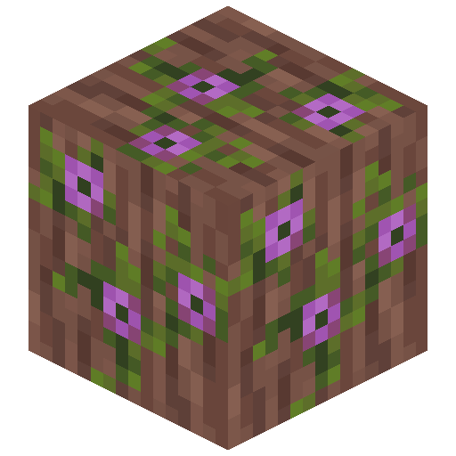
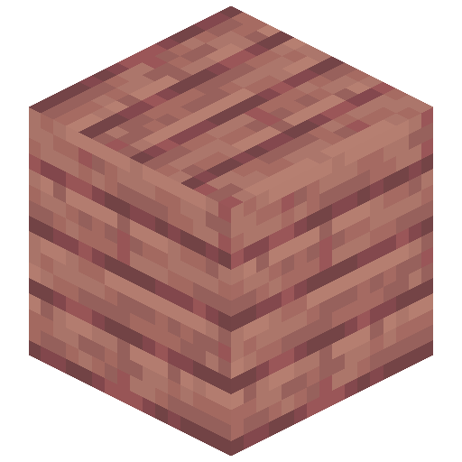

# Azalea Wood

<!--description:Learn everything about the Azalea wood type, which complements nicely Vanilla Azalea trees.-->
<!--thumbnail:images/azalea_wood.png-->

Azalea wood is a brand-new dark pink-ish wood type to complement the Vanilla azalea trees and make them more unique!
It comes with the all different available variants of wooden blocks, including the new ones this mod brings.

## Azalea Logs

Azalea wood comes with 6 log variations, two of which are not very conventional as they are flowering variants.

They all can be used in the same way as Vanilla, but flowering azalea log and wood can be sheared to make them regular azalea log or wood.
Azalea Log and Flowering Azalea Log generate instead of Oak Log in azalea trees.

### Crafting

Flowering Azalea Log and Flowering Azalea Wood can also be crafted from regular Azalea Log or Azalea Wood:

#### Flowering Azalea Log
<table class="crafting-grid">
<thead>
    <th>Crafting Table</th>
</thead>
<tbody>
    <tr>
        <td></td>
        <td>Flowering Azalea Leaves</td>
    </tr>
</tbody>
</table>

#### Flowering Azalea Wood
<table class="crafting-grid">
<thead>
    <th>Crafting Table</th>
</thead>
<tbody>
    <tr>
        <td></td>
        <td>Flowering Azalea Leaves</td>
    </tr>
</tbody>
</table>

## Azalea Planks

Azalea Planks can be crafted with any of the [Azalea Logs](#azalea-logs), like regular planks.
They also can be used to craft any of the other wood variations of this wood type.
