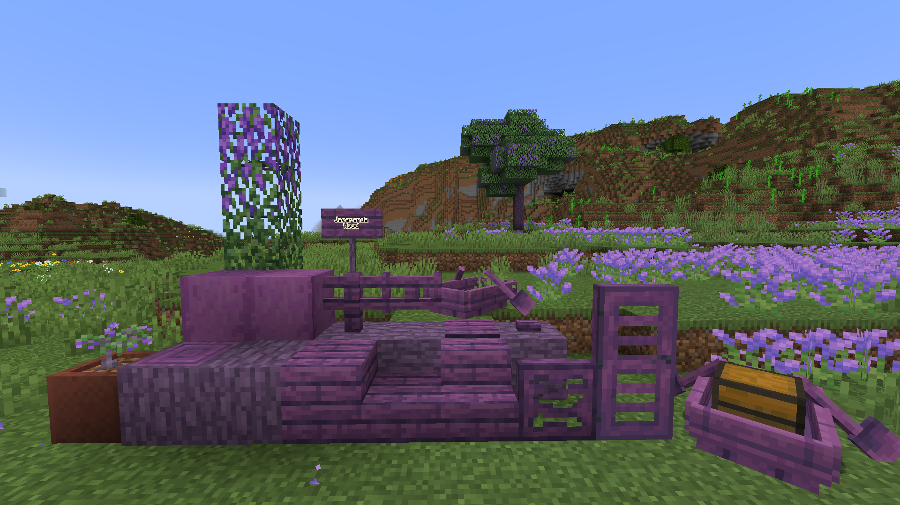
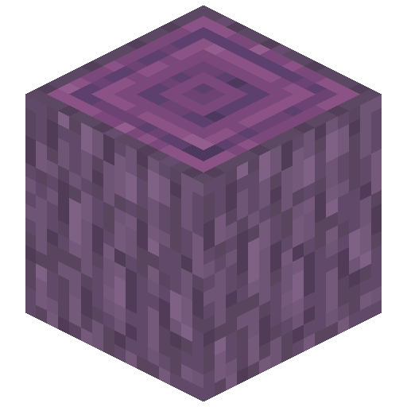
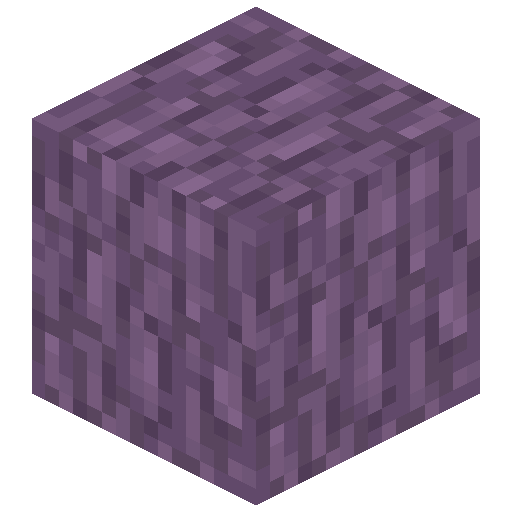
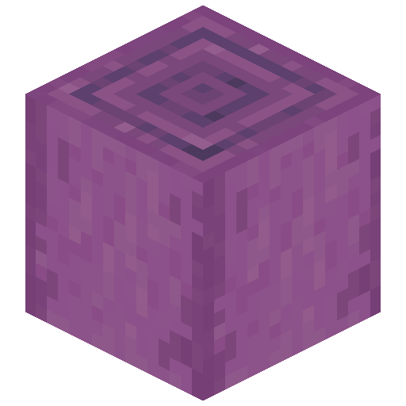
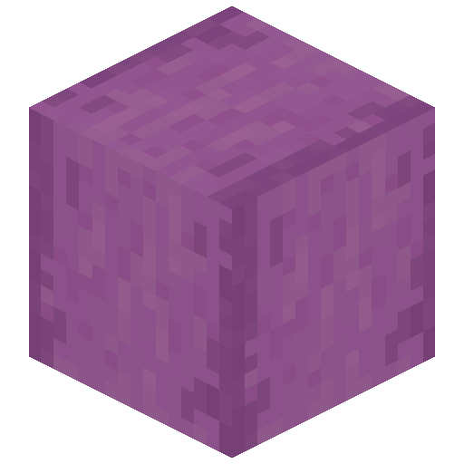
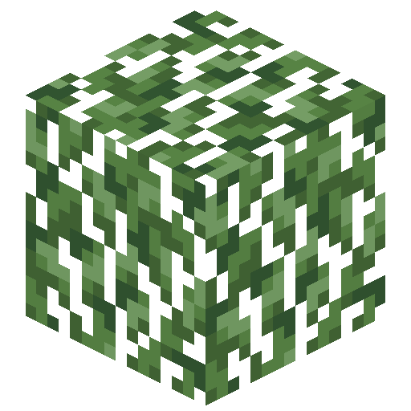
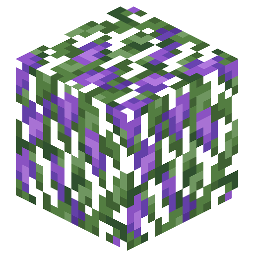
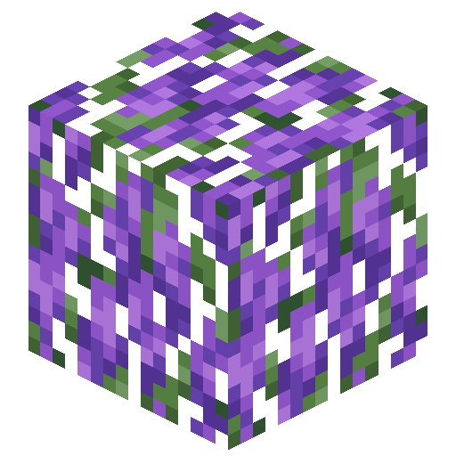

# Jacaranda Wood

<!--description:Learn everything about the Jacaranda wood type, a tree part of the Lavender Plains.-->
<!--thumbnail:images/jacaranda_wood.png;A picture of the wood set of Jacaranda wood;large-->

Jacaranda wood is a brand-new purple-ish wood type to bring more wood variety and complement the very cute [Lavender Plains](../world_generation/biomes/lavender_plains.md).
It comes with the all different available variants of wooden blocks, including the new ones this mod brings.

## Jacaranda Logs

Jacaranda wood comes with 4 log variations.

They all can be used in the same way as the usual Vanilla log blocks.
Only the Jacaranda Log generates naturally as part of the tree.

## Jacaranda Leaves

Jacaranda trees comes with quite the variety of leaves!  
When a Jacaranda tree generates it has a chance to generate either of the following variants:
 - a normal Jacaranda tree with its leaves and the budding leaves;
 - a flowering Jacaranda tree with budding leaves and flowering leaves!

## Jacaranda Planks

Jacaranda Planks can be crafted with any of the [Jacaranda Logs](#jacaranda-logs), like regular planks.
They also can be used to craft any of the other wood variations of this wood type.
