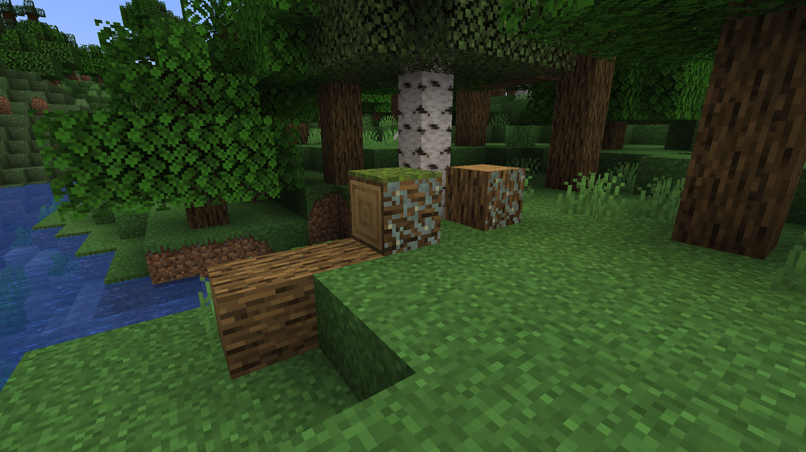
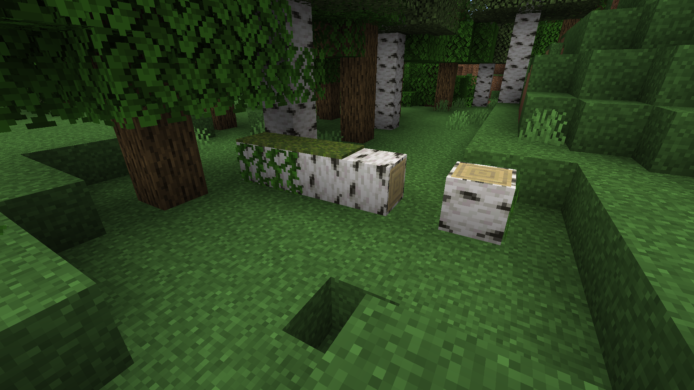

# Fallen Trees

<!--description:Fallen trees are a world generation feature introduced in Aurora's Decorations, they come in different variants.-->
<!--thumbnail:images/worldgen/features/fallen_oak_tree.png;A picture of a fallen oak tree in a forest.;large-->

Fallen Trees are a new world generation feature introduced by this mod.
They come in different variants similar to different tree types.
They can be found in several biomes.

Fallen Trees can also generate rooted dirt underneath them, moss carpets and glow lichen on them, and more!

*An Oak Fallen Tree in a Forest biome*

*A Birch Fallen Tree in a Forest biome*

*A Spruce Fallen Tree in a Old Growth Taiga biome*

## Locations

- Oak and Birch fallen trees can be found in forests, plains.
- Birch fallen trees can be found in birch forests.
- Spruce fallen trees can be found in taigas.
- Jungle fallen trees can be found in sparse jungles.

## Customazibility

Fallen trees are added to biomes following some specific criterion,
but they can be added to arbitrary biomes too using datapacks and biome tags!

Here's a list of the different biome tags available for different types of fallen trees:

- `aurorasdeco:feature/fallen_trees/forest`
- `aurorasdeco:feature/fallen_trees/birch_forest`
- `aurorasdeco:feature/fallen_trees/spruce_taiga`
- `aurorasdeco:feature/fallen_trees/snowy_spruce_taiga`
- `aurorasdeco:feature/fallen_trees/old_growth_spruce_taiga`
- `aurorasdeco:feature/fallen_trees/sparse_jungle`
