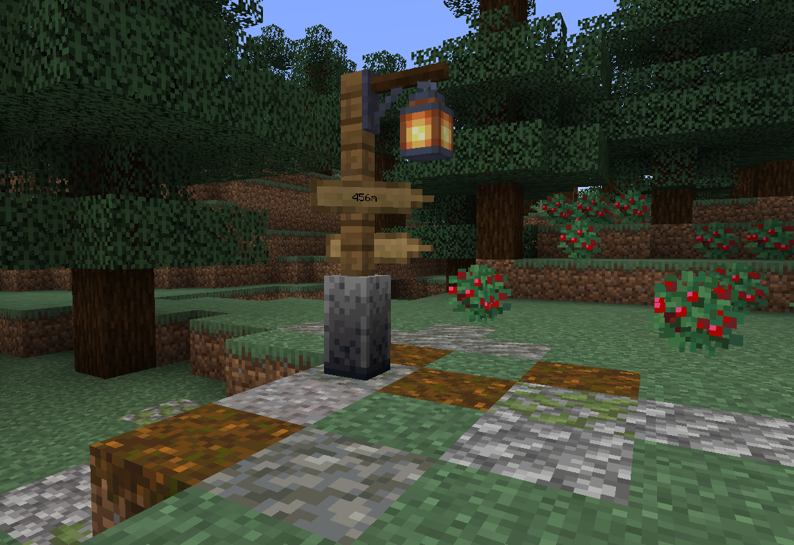

# Way Signs

<!--description:Be guided by way signs to interesting landmarks in your world.-->
<!--thumbnail:images/worldgen/features/way_sign_taiga.png;Picture of a way sign in the middle of a taiga.;large-->

Way Signs are generated lonely sign posts indicating directions to nearby interesting landmarks with some parts of a road.
They can be found in several biomes.

*A Way Sign in a Taiga*

## Locations

Way Signs can be found by default in:

- Forests, plains
- Birch forests
- Taiga
- Desert

## Landmarks

By default, the landmarks the signs are pointing to are villages.

But this can be modified by modifying the `aurorasdeco:way_sign_destinations` structure tag.
